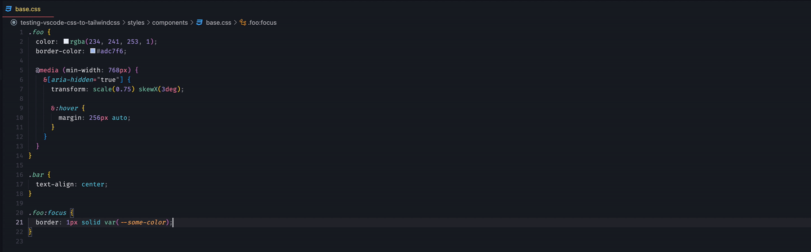

# Convert CSS to TailwindCSS 3.x

[![npm package][npm-img]][npm-url]
[![Build Status][build-img]][build-url]
[![Downloads][downloads-img]][downloads-url]
[![Issues][issues-img]][issues-url]
[![Semantic Release][semantic-release-img]][semantic-release-url]

> Convert your CSS to TailwindCSS 3.x respecting TailwindCSS configuration

**[🔗 Demo](https://transform.tools/css-to-tailwind)**

**[🔗 VS Code Extension already available 🎉](https://github.com/Jackardios/vscode-css-to-tailwindcss)**



## Features:

- supports almost all the features (except custom plugins) currently available in TailwindCSS
- the ability to set your own TailwindCSS configuration
- colors are matched regardless of the format used
- rem is converted to px (it is possible to configure the rem size)
- non-convertible CSS declarations are simply skipped
- [ambiguities](https://tailwindcss.com/docs/adding-custom-styles#resolving-ambiguities) when using css variables are resolved automatically

## Install

```bash
npm install css-to-tailwindcss
```

## Usage

```ts
import { TailwindConverter } from 'css-to-tailwindcss';

const converter = new TailwindConverter({
  remInPx: 16, // set null if you don't want to convert rem to pixels
  postCSSPlugins: [require('postcss-nested')], // add any postcss plugins to this array
  tailwindConfig: {
    // your tailwind config here
    content: [],
    theme: {
      extend: {
        colors: {
          'custom-color': {
            100: '#123456',
            200: 'hsla(210, 100%, 51.0%, 0.016)',
            300: '#654321',
            gold: 'hsl(41, 28.3%, 79.8%)',
            marine: 'rgb(4, 55, 242, 0.75)',
          },
        },
        screens: {
          'custom-screen': { min: '768px', max: '1024px' },
        },
      },
      supports: {
        grid: 'display: grid',
        flex: 'display: flex',
      },
    },
  },
});

const inputCSS = `
:root {
  --some-color: #090909;
}

.foo {
  padding: 0.875em 256px;
  margin-left: 16px;
  text-align: center;
  font-size: 12px;
  transition: color, background-color, border-color, text-decoration-color, fill,
    stroke 200ms cubic-bezier(0, 0, 0.2, 1);
  animation-delay: 200ms;

  &:hover {
    filter: blur(4px) brightness(0.5) sepia(100%) contrast(1) hue-rotate(30deg)
      invert(0) opacity(0.05) saturate(1.5);
    color: hsl(41, 28.3%, 79.8%);
    font-size: 1.25rem;
  }

  &[aria-disabled="true"] {
    width: 25%;
    color: var(--some-color);
    font-size: 1em;
  }

  @media screen and (min-width: 768px) {
    top: auto;
    bottom: auto;
    left: 25%;
    right: 25%;
  }

  @media (min-width: 768px) and (max-width: 1024px) {
    min-width: 100%;
    margin-right: -24px;
  }

  @supports (display: grid) {
    display: grid;
    grid-column: span 1 / span 1;
  }
}

.foo.bar {
  padding: 0.875rem 256px 15%;
  transform: translateX(12px) translateY(-0.5em) skew(1deg, 3deg)
    scale(-0.75, 1.05) rotate(-0.25turn);

  &::after {
    content: "*";
    animation: spin 1s linear infinite;
  }
}
`;

converter.convertCSS(inputCSS).then(({ convertedRoot, nodes }) => {
  console.log(convertedRoot.toString());
  console.log(nodes);
});
```

Console output

`convertedRoot.toString()`:

```css
:root {
  --some-color: #090909;
}

.foo {
  @apply text-center text-xs transition-colors duration-200 ease-out ml-4 px-64 py-[0.875em] hover:blur-sm hover:brightness-50 hover:sepia hover:contrast-100 hover:hue-rotate-30 hover:invert-0 hover:opacity-5 hover:saturate-150 hover:text-custom-color-gold hover:text-xl disabled:w-3/12 disabled:text-[color:var(--some-color)] disabled:text-[1em] md:inset-x-1/4 md:inset-y-auto custom-screen:min-w-full custom-screen:-mr-6 supports-grid:grid supports-grid:col-span-1;
  animation-delay: 200ms;
}

.foo.bar {
  @apply translate-x-3 translate-y-[-0.5em] skew-x-1 skew-y-3 rotate-[-0.25turn] pt-3.5 pb-[15%] px-64 -scale-x-75 scale-y-105 after:content-["*"] after:animate-spin;
}
```

`nodes`:

```js
[
  {
    rule: {
      selector: '.foo',
      // ...
    },
    tailwindClasses: [
      'text-center',
      'text-xs',
      'transition-colors',
      'duration-200',
      'ease-out',
      'ml-4',
      'px-64',
      'py-[0.875em]',
      'hover:blur-sm',
      'hover:brightness-50',
      'hover:sepia',
      'hover:contrast-100',
      'hover:hue-rotate-30',
      'hover:invert-0',
      'hover:opacity-5',
      'hover:saturate-150',
      'hover:text-custom-color-gold',
      'hover:text-xl',
      'disabled:w-3/12',
      'disabled:text-[color:var(--some-color)]',
      'disabled:text-[1em]',
      'md:inset-x-1/4',
      'md:inset-y-auto',
      'custom-screen:min-w-full',
      'custom-screen:-mr-6',
      'supports-grid:grid',
      'supports-grid:col-span-1',
    ],
  },
  {
    rule: {
      selector: '.foo.bar',
      // ...
    },
    tailwindClasses: [
      'translate-x-3',
      'translate-y-[-0.5em]',
      'skew-x-1',
      'skew-y-3',
      'rotate-[-0.25turn]',
      'pt-3.5',
      'pb-[15%]',
      'px-64',
      '-scale-x-75',
      'scale-y-105',
      'after:content-["*"]',
      'after:animate-spin',
    ],
  },
];
```

## API

### TailwindConverter(options?)

| Option                       | Type               | Default | Description                                                                              |
| ---------------------------- | ------------------ | ------- | ---------------------------------------------------------------------------------------- |
| remInPx                      | `number` \| `null` | `null`  | `rem` in `px` unit. Set null if you don't want to convert rem to pixels                  |
| arbitraryPropertiesIsEnabled | `boolean`          | `false` | defines whether non-convertible properties should be converted as "arbitrary properties" |
| tailwindConfig               | `Config`           | {}      | Set your tailwind config here                                                            |
| postCSSPlugins               | `AcceptedPlugin[]` | []      | Array of acceptable postcss plugins                                                      |

[build-img]: https://github.com/jackardios/css-to-tailwindcss/actions/workflows/release.yml/badge.svg
[build-url]: https://github.com/jackardios/css-to-tailwindcss/actions/workflows/release.yml
[downloads-img]: https://img.shields.io/npm/dt/css-to-tailwindcss
[downloads-url]: https://www.npmtrends.com/css-to-tailwindcss
[npm-img]: https://img.shields.io/npm/v/css-to-tailwindcss
[npm-url]: https://www.npmjs.com/package/css-to-tailwindcss
[issues-img]: https://img.shields.io/github/issues/jackardios/css-to-tailwindcss
[issues-url]: https://github.com/jackardios/css-to-tailwindcss/issues
[semantic-release-img]: https://img.shields.io/badge/%20%20%F0%9F%93%A6%F0%9F%9A%80-semantic--release-e10079.svg
[semantic-release-url]: https://github.com/semantic-release/semantic-release
