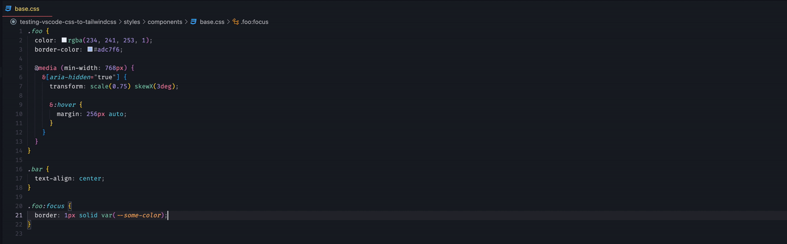

# Convert CSS to TailwindCSS 3.x

[![npm package][npm-img]][npm-url]
[![Build Status][build-img]][build-url]
[![Downloads][downloads-img]][downloads-url]
[![Issues][issues-img]][issues-url]
[![Semantic Release][semantic-release-img]][semantic-release-url]

> Convert your CSS to TailwindCSS 3.x respecting TailwindCSS configuration

**[🔗 Demo](https://transform.tools/css-to-tailwind)**

**[🔗 VS Code Extension already available 🎉](https://github.com/Jackardios/vscode-css-to-tailwindcss)**



## Features:

- supports almost all the features (except custom plugins) currently available in TailwindCSS
- the ability to set your own TailwindCSS configuration
- colors are matched regardless of the format used
- rem is converted to px (it is possible to configure the rem size)
- non-convertible CSS declarations are simply skipped
- [ambiguities](https://tailwindcss.com/docs/adding-custom-styles#resolving-ambiguities) when using css variables are resolved automatically

## Install

```bash
npm install css-to-tailwindcss
```

## Usage

```ts
import { TailwindConverter } from 'css-to-tailwindcss';

const converter = new TailwindConverter({
  remInPx: 16, // set null if you don't want to convert rem to pixels
  postCSSPlugins: [require('postcss-nested')], // add any postcss plugins to this array
  tailwindConfig: {
    // your tailwind config here
    content: [],
    theme: {
      extend: {
        colors: {
          'custom-color': {
            100: '#123456',
            200: 'hsla(210, 100%, 51.0%, 0.016)',
            300: '#654321',
            gold: 'hsl(41, 28.3%, 79.8%)',
            marine: 'rgb(4, 55, 242, 0.75)',
          },
        },
        screens: {
          'custom-screen': { min: '768px', max: '1024px' },
        },
      },
      supports: {
        grid: 'display: grid',
        flex: 'display: flex',
      },
    },
  },
});

const inputCSS = `
:root {
  --some-color: #090909;
}

.foo {
  padding: 0.875em 256px;
  margin-left: 16px;
  text-align: center;
  font-size: 12px;
  transition: color, background-color, border-color, text-decoration-color, fill,
    stroke 200ms cubic-bezier(0, 0, 0.2, 1);
  animation-delay: 200ms;

  &:hover {
    filter: blur(4px) brightness(0.5) sepia(100%) contrast(1) hue-rotate(30deg)
      invert(0) opacity(0.05) saturate(1.5);
    color: hsl(41, 28.3%, 79.8%);
    font-size: 1.25rem;
  }

  &[aria-disabled="true"] {
    width: 25%;
    color: var(--some-color);
    font-size: 1em;
  }

  @media screen and (min-width: 768px) {
    top: auto;
    bottom: auto;
    left: 25%;
    right: 25%;
  }

  @media (min-width: 768px) and (max-width: 1024px) {
    min-width: 100%;
    margin-right: -24px;
  }

  @supports (display: grid) {
    display: grid;
    grid-column: span 1 / span 1;
  }
}

.foo.bar {
  padding: 0.875rem 256px 15%;
  transform: translateX(12px) translateY(-0.5em) skew(1deg, 3deg)
    scale(-0.75, 1.05) rotate(-0.25turn);

  &::after {
    content: "*";
    animation: spin 1s linear infinite;
  }
}
`;

converter.convertCSS(inputCSS).then(({ convertedRoot, nodes }) => {
  console.log(convertedRoot.toString());
  console.log(nodes);
});
```

Console output

`convertedRoot.toString()`:

<!-- prettier-ignore -->
```css
:root {
  --some-color: #090909;
}
.foo {
  @apply text-center text-xs ml-4 px-64 py-[0.875em] hover:text-custom-color-gold hover:text-xl aria-disabled:w-3/12 aria-disabled:text-[color:var(--some-color)] aria-disabled:text-[1em] md:inset-x-1/4 md:inset-y-auto custom-screen:min-w-full custom-screen:-mr-6 supports-grid:grid supports-grid:col-span-1;
  transition: color, background-color, border-color, text-decoration-color, fill,
    stroke 200ms cubic-bezier(0, 0, 0.2, 1);
  animation-delay: 200ms;
}
.foo:hover {
  filter: blur(4px) brightness(0.5) sepia(100%) contrast(1) hue-rotate(30deg)
      invert(0) opacity(0.05) saturate(1.5);
}
.foo.bar {
  @apply pt-3.5 pb-[15%] px-64 after:content-["*"] after:animate-spin;
  transform: translateX(12px) translateY(-0.5em) skew(1deg, 3deg)
    scale(-0.75, 1.05) rotate(-0.25turn);
}
```

Declarations that can't be expressed with utilities without changing the result stay as CSS:
a list of transitions with different durations, `filter` with `opacity()` or with functions in an order
different from the one Tailwind applies them in, `skew()` with two angles, etc.

`nodes`:

```js
[
  {
    rule: {
      selector: '.foo',
      // ...
    },
    tailwindClasses: [
      'text-center',
      'text-xs',
      'ml-4',
      'px-64',
      'py-[0.875em]',
      'hover:text-custom-color-gold',
      'hover:text-xl',
      'aria-disabled:w-3/12',
      'aria-disabled:text-[color:var(--some-color)]',
      'aria-disabled:text-[1em]',
      'md:inset-x-1/4',
      'md:inset-y-auto',
      'custom-screen:min-w-full',
      'custom-screen:-mr-6',
      'supports-grid:grid',
      'supports-grid:col-span-1',
    ],
  },
  {
    rule: {
      selector: '.foo.bar',
      // ...
    },
    tailwindClasses: [
      'pt-3.5',
      'pb-[15%]',
      'px-64',
      'after:content-["*"]',
      'after:animate-spin',
    ],
  },
];
```

`convertedRoot` is the whole converted stylesheet, and `nodes` lists the rules of `convertedRoot` that got an `@apply`:
`rule` is the rule itself and `tailwindClasses` are the classes of its `@apply`. Declarations left as CSS are
only in `convertedRoot`.

A rule with variants (e.g. `.foo:hover` or `.foo` in a media query) is merged into the preceding `.foo` rule if this
doesn't change the result. Otherwise a new `.foo` rule is created in its place, so a selector may occur in `nodes`
several times, e.g. `.foo:hover { color: red } .foo { display: block }` becomes
`.foo { @apply hover:text-[red] } .foo { @apply block }`.

## API

### TailwindConverter(options?)

| Option                       | Type               | Default | Description                                                                                                                                                                                                      |
| ---------------------------- | ------------------ | ------- | ---------------------------------------------------------------------------------------------------------------------------------------------------------------------------------------------------------------- |
| remInPx                      | `number` \| `null` | `null`  | `rem` in `px` unit. Set null if you don't want to convert rem to pixels                                                                                                                                          |
| arbitraryPropertiesIsEnabled | `boolean`          | `false` | defines whether non-convertible properties should be converted as "arbitrary properties"                                                                                                                         |
| tailwindConfig               | `Config`           | {}      | Set your tailwind config here                                                                                                                                                                                    |
| postCSSPlugins               | `AcceptedPlugin[]` | []      | Array of acceptable postcss plugins                                                                                                                                                                              |
| arbitraryVariants            | `boolean`          | `false` | converts `@media`/`@supports` that don't match the theme to arbitrary variants, e.g. `[@media_(max-width:_767px)]:`                                                                                              |
| strict                       | `boolean`          | `false` | avoids utilities that don't reproduce the source declaration exactly: uses exact arbitrary values instead (e.g. `text-sm` also sets `line-height`) or leaves the declaration as CSS (e.g. `transform` functions) |

## How it works and limitations

- Utilities are added with `@apply` to the rule they came from. Variants (`:hover`, `::before`, `[aria-*]`, `[data-*]`,
  `@media`, `@supports`) are moved to the preceding rule with the base selector only if this can't change
  which declaration wins; otherwise a new rule with the base selector is created in place, or the utilities are
  added to the rule itself without variants.
- `before:` and `after:` variants are used only together with a `content-*` utility for the same pseudo-element,
  because they override `content` of the source CSS.
- A declaration is converted entirely or not at all. Declarations following an unconverted declaration of the same
  property are not converted, fallbacks (the same property with different values) are kept as CSS.
- Utilities overridden by later declarations of the same rule are dropped, e.g. `margin-top: 16px; margin: 8px` becomes `m-2`.
- Rules inside `@keyframes`, `@font-face`, `@page` and other non-style at-rules are never converted.
- `screen and (...)` is converted as `(...)`: the `screen` media type is dropped.
- Tailwind has no per-side border styles. A side shorthand is converted only with the `solid` style
  (e.g. `border-top: 1px solid` becomes `border-t border-solid border-t-current`), which sets `border-style: solid`
  on all sides, as the Tailwind preflight does. Other styles and `strict` leave the declaration as CSS.
- Invisible borders are converted idiomatically: `border: none` becomes `border-none` and `border-right: none` becomes
  `border-r-0`, which don't reset the other parts of the border. They are left as CSS if the following declarations
  of the rule set these parts.
- Shorthands reset their omitted parts, so `border: solid red` becomes `border-[medium] border-solid border-[red]`.
  `transition` doesn't reset `transition-delay` unless `strict` is enabled.
- `transform`, `filter` and `backdrop-filter` functions are converted to Tailwind utilities, which compose with the
  functions set by other rules (e.g. `rotate-45 hover:translate-x-1` keeps the rotation on hover). With `strict`
  these declarations are left as CSS.
- `@media (prefers-color-scheme: dark)` is converted to `dark:` only with `darkMode: 'media'` (default).
- Only TailwindCSS 3.x is supported.

[build-img]: https://github.com/jackardios/css-to-tailwindcss/actions/workflows/release.yml/badge.svg
[build-url]: https://github.com/jackardios/css-to-tailwindcss/actions/workflows/release.yml
[downloads-img]: https://img.shields.io/npm/dt/css-to-tailwindcss
[downloads-url]: https://www.npmtrends.com/css-to-tailwindcss
[npm-img]: https://img.shields.io/npm/v/css-to-tailwindcss
[npm-url]: https://www.npmjs.com/package/css-to-tailwindcss
[issues-img]: https://img.shields.io/github/issues/jackardios/css-to-tailwindcss
[issues-url]: https://github.com/jackardios/css-to-tailwindcss/issues
[semantic-release-img]: https://img.shields.io/badge/%20%20%F0%9F%93%A6%F0%9F%9A%80-semantic--release-e10079.svg
[semantic-release-url]: https://github.com/semantic-release/semantic-release
